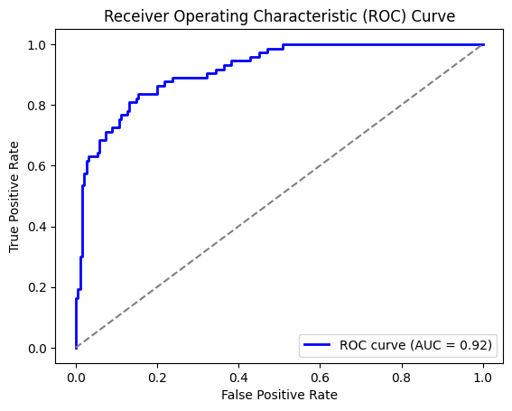

# Description
Classification of survivors on the titanic based on available features using CatBoost based on the dataset from Kaggle.

# Results

Best results are from with the parameters of cross validation run 5:

    Fold 1 Accuracy: 0.8244
    Fold 2 Accuracy: 0.8473
    Fold 3 Accuracy: 0.8626
    Fold 4 Accuracy: 0.8626
    Fold 5 Accuracy: 0.8702
    Fold 6 Accuracy: 0.8092
    Fold 7 Accuracy: 0.8550
    Fold 8 Accuracy: 0.8855
    Fold 9 Accuracy: 0.8550
    Fold 10 Accuracy: 0.8769
    Average Accuracy: 0.8549

ROC curve for the best run:

